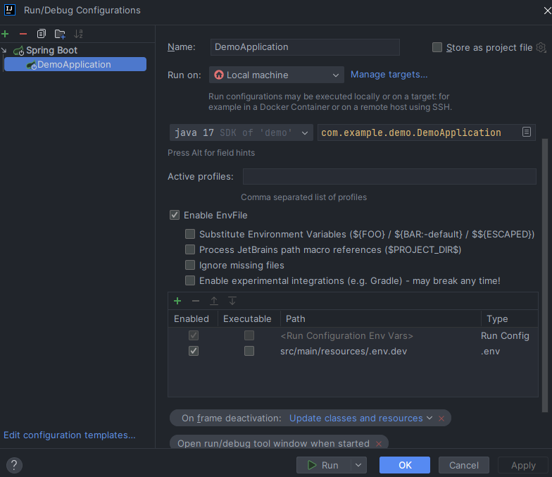
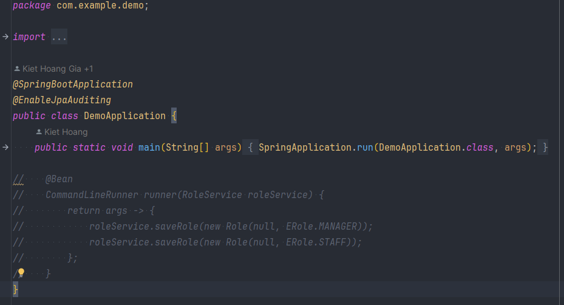
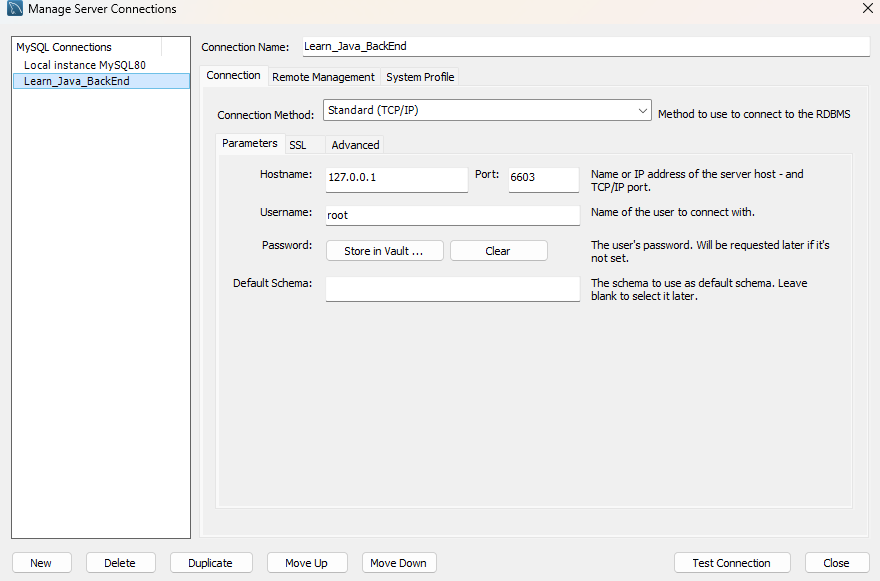
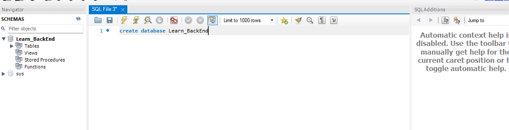
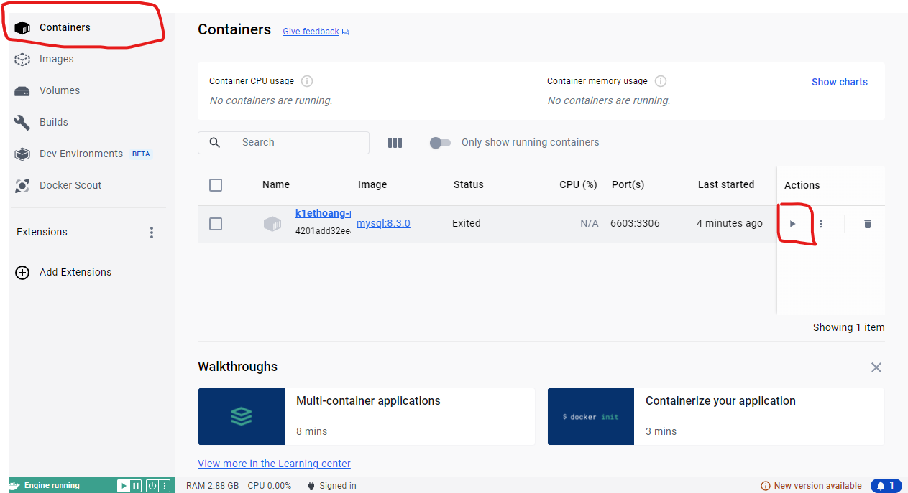

# Rent data management

- This is a project while I learn Spring boot (v2)
- Tech:
    - Spring boot
    - Spring security
    - Spring mail
    - Maven
    - JWT (Json Web Token)
    - Docker (Run database)
    - Swagger (Spring doc)
- IDE:
    - IntelliJ IDEA

# Features:

- Authentication, Authorization
- CRUD
- Validator (not null, format, check duplicate)
- Import/Export (CSV)
- Paging
- Searching

# How to run

- Clone this repository
- Make sure you are using JDK 17

### 1. Update `.env`

- Rename `.env.example` in `resources` folder to `.env.dev` and change your value to set up mail
  ```
  EMAIL_USERNAME=<Your email address>
  EMAIL_PASSWORD=<Your email's password>
  ```
- Install plugin [EnvFile](https://plugins.jetbrains.com/plugin/7861-envfile) and do like
  document or setting like that in `Edit configuration` of
  project 

### 2. Initial role entity

- Open comment at the first time run project to add Role
  

### 3. Set up Database with docker

- Run 2 command under

```docker
docker image pull mysql:8.3.0
```

```docker
docker run --name k1ethoang-mysql-container -d -e MYSQL_ROOT_PASSWORD=123456 -p 6603:3306 mysql:8.3.0
```

### 4. Set up MySQL

- Create connection (Do not change):
    - Username: root
    - Password: 123456

  

- Create database in MySQL name: `Learn_BackEnd` or use script `create database Learn_BackEnd`
  

### 5. Run project

- Run your docker first, you can run
  via [Docker Desktop](https://www.docker.com/products/docker-desktop/)
  

- Run command in your project folder

```
./mvnw spring-boot:run
```

- Access http://localhost:9090/swagger-ui/index.html to see swagger doc