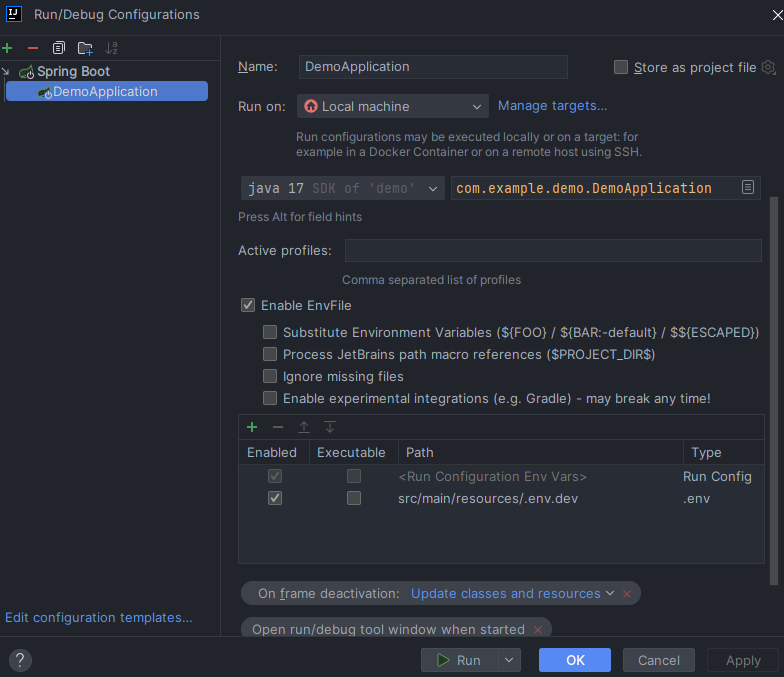
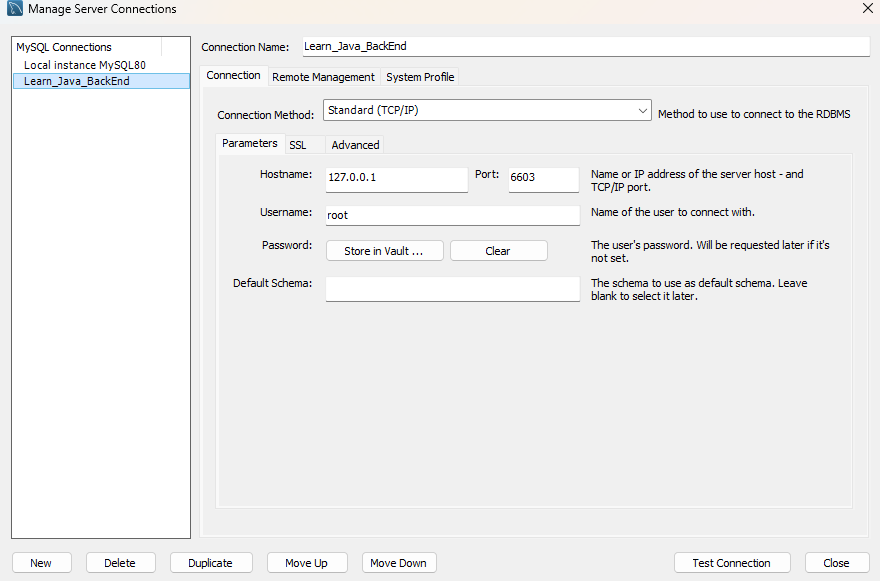
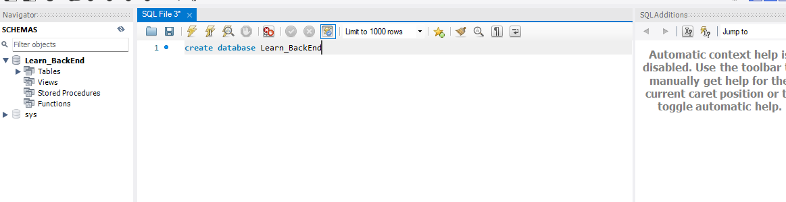
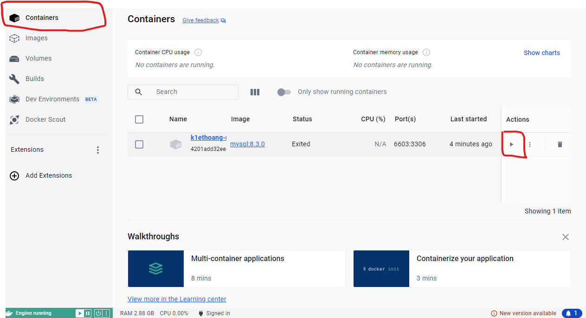

# Rent data management

- Backend API for managing apartment rental data (apartments, customers, contracts, users) — built while learning Spring Boot (v2).
- [Repo Frontend](https://github.com/Bie-NHD/Rent-management-dashboard)

## Tech stack

- **Framework**: Spring Boot 2.7 (Web, Data JPA, Data REST, Mail, DevTools)
- **Security**: Spring Security + JWT (`jjwt` 0.12.5), role-based access (`MANAGER`, `STAFF`)
- **Database**: MySQL 8.3 (via Docker), Hibernate/JPA
- **API docs**: Springdoc OpenAPI / Swagger UI
- **Import/Export**: Apache Commons CSV, Apache POI (Excel `.xlsx`)
- **Testing**: JUnit 5, Spring Security Test, Testcontainers (MySQL), Selenium (UI tests)
- **Build**: Maven, Java 11
- **Other**: Lombok, Spring Mail (SMTP), Docker (database only)

## Features

- **Auth**: register, login, logout, refresh token, reset password (JWT-based)
- **Users**: CRUD, block/unblock, change password, get current user details, statistics, export
- **Apartments**: CRUD, search, paging, import (CSV), export, statistics
- **Customers**: CRUD, search, paging, import (CSV), export, statistics
- **Contracts**: CRUD, search, paging, export, statistics
- **Validation**: not-null checks, format checks, duplicate checks, custom exceptions (`NotFoundException`, `DuplicatedException`, `ForbiddenException`, etc.) with a global exception handler
- **Standardized API responses** (`ApiResponse` / `ErrorResponse`)
- **Selenium UI tests** for Login Page and Change Password Page

## Main entities

- `User` (with `Role`: MANAGER / STAFF)
- `Apartment`
- `Customer`
- `Contract`

## Updates

- [2025.03] Bump `poi-ooxml` to 5.4.0
- [2024.10.31] Selenium tests for `Login Page` and `Change Password Page`
- [2024.10.29] Init **Role** & **first user** in database

# How to run

- Clone this repository
- Make sure you are using JDK 11 (see `pom.xml` `java.version`)
- Install extension [Lombok](https://projectlombok.org/) in IntelliJ IDEA

### 1. Update `.env` (Optional - if you need to send mail)

- Rename `.env.example` in `resources` folder to `.env.dev` and change your value to set up mail
  ```
  EMAIL_USERNAME=<Your email address>
  EMAIL_PASSWORD=<Your email's password>
  ```
- Install plugin [EnvFile](https://plugins.jetbrains.com/plugin/7861-envfile) and do like
  document or setting like that in `Edit configuration` of
  project 

### 2. Initial role entity

- Just run and do not care about that


### 3. Set up Database with docker

- Run 2 command under

```docker
docker image pull mysql:8.3.0
```

```docker
docker run --name k1ethoang-mysql-container -d -e MYSQL_ROOT_PASSWORD=123456 -p 6603:3306 mysql:8.3.0
```

### 4. Set up MySQL

- Create connection (Do not change):
    - Username: root
    - Password: 123456

  

- Create database in MySQL name: `Learn_BackEnd` or use script `create database Learn_BackEnd`
  

### 5. Run project

- Run your docker first, you can run
  via [Docker Desktop](https://www.docker.com/products/docker-desktop/)
  

- Run command in your project folder

```
./mvnw spring-boot:run
```

- Access http://localhost:9090/swagger-ui/index.html to see swagger doc
